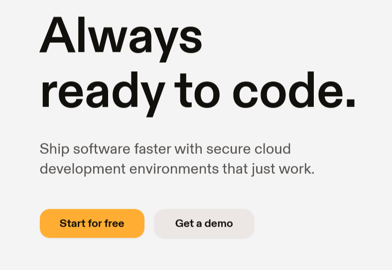
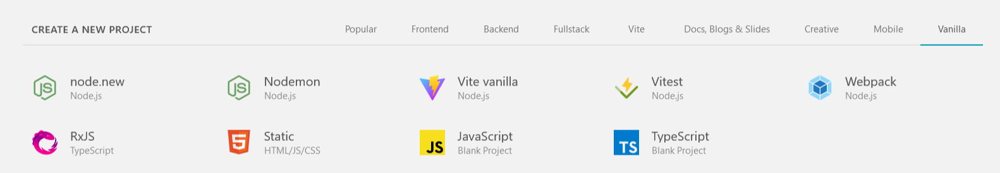

# Corso Online IDE

Prodotti per spostare lo sviluppo da Offline a Online

<!-- _paginate: false -->
<!-- _footer: "" -->
<!-- style: "
img[alt~='center'] {
  display: block;
  margin: 0 auto;
}
" -->

---

## Scopo del corso

All'interno di questo corso vedremo una serie di prodotti che permettono lavorare direttamente online su progetti GitHub

---

## CodeSpace

CodeSpace di GitHub è un ambiente di sviluppo integrato basato sul cloud che consente agli sviluppatori di creare, testare e distribuire le loro applicazioni direttamente dalla piattaforma GitHub.
CodeSpace offre una configurazione predefinita con tutti gli strumenti necessari per lo sviluppo, come ad esempio i linguaggi di programmazione, i framework, le librerie, gli strumenti di versioning e le infrastrutture di hosting.
Gli sviluppatori possono creare facilmente nuovi progetti e collaborare con altri sviluppatori sulla stessa piattaforma. CodeSpace supporta anche l'integrazione con GitHub Actions e GitHub Packages, consentendo agli sviluppatori di automatizzare i processi di testing, compilazione e distribuzione delle applicazioni.
In sintesi, CodeSpace semplifica e accelera il processo di sviluppo delle applicazioni e promuove la collaborazione tra gli sviluppatori all'interno della piattaforma GitHub.

---

## GitPod

Gitpod è un ambiente di sviluppo integrato (IDE) basato su browser per lo sviluppo di codice in remoto.
Permette di creare e gestire ambienti di sviluppo personalizzati, che vengono eseguiti su server remoti, senza la necessità di installare software o librerie sul proprio computer.
Gli utenti possono collaborare su progetti in tempo reale e versionare il proprio codice su Git, tutto all'interno dell'ambiente Gitpod. Inoltre, Gitpod è integrato con GitHub, Bitbucket e GitLab, il che rende facile il lavoro con i repository Git.

---

## GitPod homepage

<https://gitpod.io/login>

---

## Stackblitz

Stackblitz è una piattaforma di sviluppo web basata sul cloud che consente agli sviluppatori di creare, testare e condividere applicazioni Angular, React, Vue.js e TypeScript in modo rapido ed efficiente.
Offre un ambiente di sviluppo integrato (IDE) online completo di funzionalità avanzate di editing, debugging, integrazione con Git e gestione dei pacchetti npm, il tutto in un ambiente sandbox sicuro e isolato.
Stackblitz è stato lanciato nel 2017 ed è diventato rapidamente una delle principali risorse online per gli sviluppatori di frontend.

---

## Stackblitz progetti

<https://stackblitz.com>

---

## VSCode.dev

VS Code Dev è un ambiente di sviluppo integrato (IDE) online basato sul popolare editor di codice sorgente di Microsoft Visual Studio Code.
Consente agli sviluppatori di accedere e modificare il proprio codice sorgente in qualsiasi momento e ovunque attraverso un browser web senza dover installare software sul proprio computer locale.
VS Code Dev è particolarmente utile per sviluppatori a distanza che possono condividere e lavorare sullo stesso progetto in modo collaborativo e in tempo reale.
Inoltre, VS Code Dev supporta numerose estensioni e integrazioni di linguaggi di programmazione che rendono l'esperienza di sviluppo più efficiente e personalizzata per le esigenze dell'utente.

<https://vscode.dev/>

---

## Fonti usate per la creazione di queste slide

<https://it.wikipedia.org> : definizioni e argomenti
<https://chat.openai.com> : ChatGPT

Ogni immagine inserita riporta la fonte

---

## Disclaimer

L'autore ha generato questo testo in parte con GPT-3, il modello di generazione del linguaggio su larga scala di OpenAI. Dopo aver generato la bozza della lingua, l'autore ha rivisto, modificato e rivisto la lingua a proprio piacimento e si assume la responsabilità ultima del contenuto di questa pubblicazione.
